# PlatterOps DevOps Stack — Full Explanation & Interview Guide

> Covers: Docker · Docker Compose · Flyway · Kubernetes (Kind) · Prometheus · Grafana · k6 · GitHub Actions CI/CD
> Every diagram references real files in this project.

---

## Table of Contents

1. [Where Everything Fits — The Big Picture](#1-where-everything-fits--the-big-picture)
2. [Docker — Containerising the App](#2-docker--containerising-the-app)
3. [Docker Compose — Running Everything Locally](#3-docker-compose--running-everything-locally)
4. [Flyway — Version Control for the Database](#4-flyway--version-control-for-the-database)
5. [Kubernetes — Running in a Real Cluster](#5-kubernetes--running-in-a-real-cluster)
6. [Prometheus — Collecting Metrics](#6-prometheus--collecting-metrics)
7. [Grafana — Visualising Metrics](#7-grafana--visualising-metrics)
8. [k6 — Load & Smoke Testing](#8-k6--load--smoke-testing)
9. [GitHub Actions — CI/CD Pipeline](#9-github-actions--cicd-pipeline)
10. [Interview Questions on Every Tool](#10-interview-questions-on-every-tool)

---

## 1. Where Everything Fits — The Big Picture

### Two Environments: Local Dev vs Kubernetes

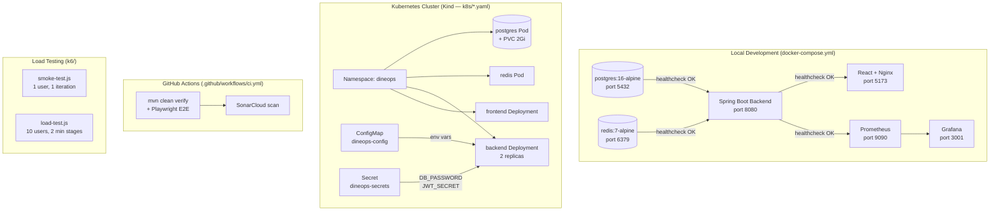

**Simple mental model:**

| Stage | Tool | What It Does |
|---|---|---|
| Write code | IDE + Git | Author features |
| Push code | GitHub Actions | Run tests automatically |
| Run locally | Docker Compose | All services in one command |
| Migrate schema | Flyway | Apply SQL migrations on startup |
| Deploy to cluster | Kubernetes (Kind) | Orchestrate containers in production |
| Collect metrics | Prometheus | Scrape numbers from the backend |
| Show dashboards | Grafana | Turn those numbers into charts |
| Test performance | k6 | Simulate real user load |

---

## 2. Docker — Containerising the App

### What is Docker?

A Docker **image** is a packaged snapshot of your app + all its dependencies (Java, the JAR file, OS libraries). A Docker **container** is a running instance of that image.

**Analogy:** An image is a recipe. A container is a dish made from that recipe. Multiple dishes can come from the same recipe, and they're all identical.

### Why use Docker?

Without Docker: "It works on my machine but not on the server" — different Java versions, missing env vars, different OS.

With Docker: Everyone (developer, CI server, production) runs the exact same image. The environment is baked in.

---

### Backend Dockerfile — Multi-Stage Build

```
backend/Dockerfile
```

```dockerfile
# Stage 1: BUILD — uses JDK (heavy, ~400MB)
FROM eclipse-temurin:21-jdk-alpine AS build
WORKDIR /app
COPY mvnw .
COPY .mvn .mvn
COPY pom.xml .
RUN ./mvnw dependency:go-offline -B    # download deps (cached layer)
COPY src ./src
RUN ./mvnw package -DskipTests -B      # compile + package → target/*.jar

# Stage 2: RUNTIME — uses JRE only (lighter, ~180MB)
FROM eclipse-temurin:21-jre-alpine
WORKDIR /app
RUN addgroup -S app && adduser -S app -G app   # non-root user (security)
COPY --from=build /app/target/*.jar app.jar    # only copy the JAR from stage 1
RUN chown -R app:app /app
USER app                                        # run as non-root
EXPOSE 8080
ENTRYPOINT ["java", "-jar", "app.jar"]
```

**Why two stages?**

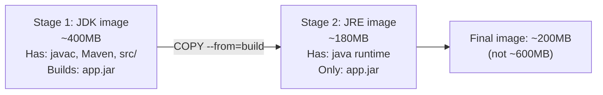

Stage 1 has the full JDK, Maven, and source code — none of which should ship to production. Stage 2 copies only the compiled JAR. The final image is ~200MB instead of ~600MB. Smaller images = faster pulls, less attack surface.

**Security note:** `adduser -S app` creates a non-root user. Running as root inside a container is dangerous — if the app is compromised, the attacker has root access to the container.

---

### Frontend Dockerfile — Build + Nginx

```
frontend/Dockerfile
```

```dockerfile
# Stage 1: BUILD — Node.js compiles React to static files
FROM node:20-alpine AS build
WORKDIR /app
ARG VITE_API_URL=/api          # build-time argument (baked into the JS bundle)
ENV VITE_API_URL=${VITE_API_URL}
COPY package*.json ./
RUN npm ci                      # install exact versions from package-lock.json
COPY . .
RUN npm run build               # produces /app/dist — static HTML/JS/CSS

# Stage 2: SERVE — Nginx serves the static files
FROM nginx:alpine
COPY --from=build /app/dist /usr/share/nginx/html
COPY nginx.conf /etc/nginx/conf.d/default.conf   # SPA routing + compression + security headers
EXPOSE 80
CMD ["nginx", "-g", "daemon off;"]
```

**Why Nginx for the frontend?**

React is just static files (HTML, JS, CSS) after `npm run build`. You don't need Node.js to serve them in production — Nginx does it much faster. Nginx also handles:
- **SPA routing:** All routes (e.g., `/dashboard/kitchen`) redirect to `index.html` — React Router handles the rest
- **Gzip compression:** Reduces bundle size on the wire
- **Security headers:** X-Frame-Options, X-Content-Type-Options, etc.

---

### Docker Image Layers — Why Layer Order Matters

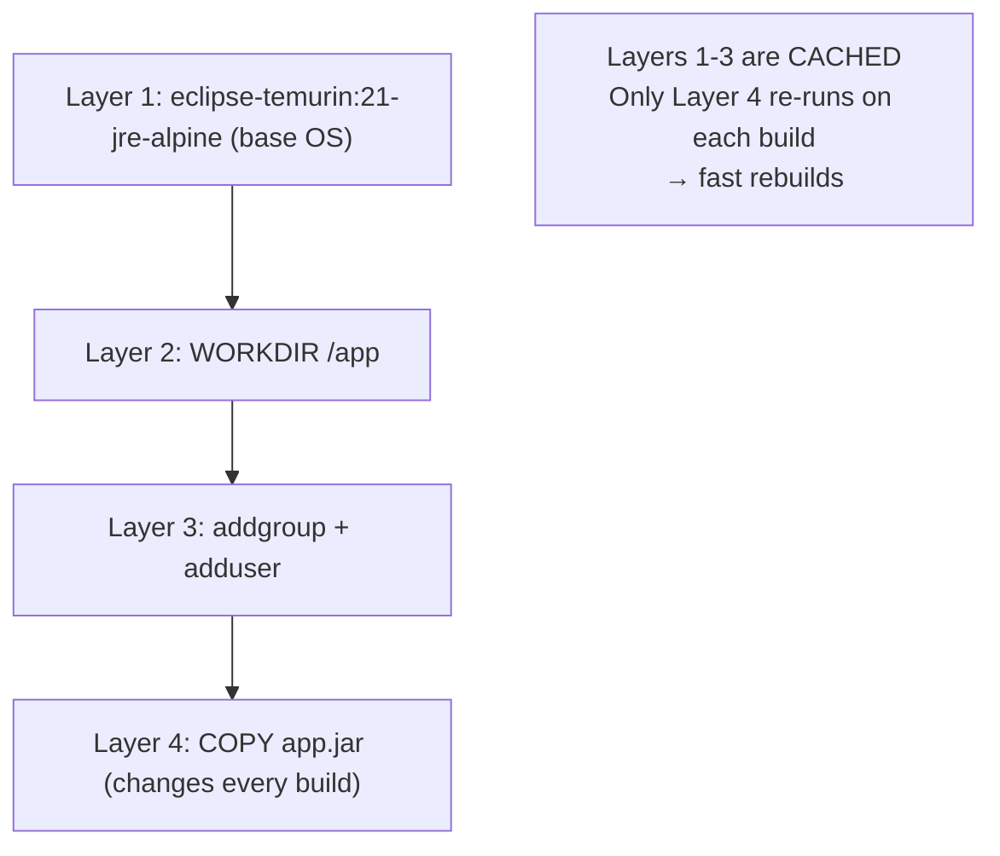

Docker caches each layer. Since `pom.xml` and dependencies change rarely, the `dependency:go-offline` step is cached. Only the `COPY src` + `mvnw package` layers re-run when source code changes.

---

## 3. Docker Compose — Running Everything Locally

### What is Docker Compose?

Docker Compose lets you define and run **multiple containers together** as one application, with a single file and single command.

```bash
docker-compose up --build   # build images + start all 6 containers
docker-compose down         # stop and remove all containers
docker-compose logs backend # see logs from one service
```

### PlatterOps `docker-compose.yml` — Full Service Graph

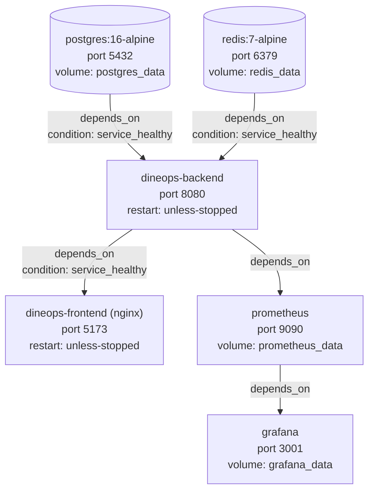

### Key Concepts Explained

**`depends_on` with `condition: service_healthy`**

```yaml
backend:
  depends_on:
    postgres:
      condition: service_healthy   # waits for postgres healthcheck to pass
    redis:
      condition: service_healthy
```

Without this, the backend starts immediately and crashes because the database isn't ready yet. `service_healthy` waits for the healthcheck to pass first.

**Healthchecks**

```yaml
postgres:
  healthcheck:
    test: ["CMD-SHELL", "pg_isready -U dineops"]  # pg_isready checks if Postgres accepts connections
    interval: 10s
    timeout: 5s
    retries: 5

backend:
  healthcheck:
    test: ["CMD-SHELL", "wget -qO- http://localhost:8080/actuator/health | grep -q UP"]
    # calls Spring Actuator health endpoint — if it returns "UP", container is healthy
```

**Volumes**

```yaml
volumes:
  postgres_data:   # named volume — data persists between docker-compose restarts
  redis_data:
  prometheus_data:
  grafana_data:
```

Named volumes persist data on the host machine. If you `docker-compose down` and `up` again, your database data is still there. `docker-compose down -v` removes volumes too (fresh start).

**Environment variable injection**

```yaml
backend:
  env_file:
    - .env                   # loads .env file — DB passwords, JWT secret, etc.
  environment:
    SPRING_DATASOURCE_URL: jdbc:postgresql://postgres:5432/${POSTGRES_DB}
    REDIS_HOST: redis         # "redis" = Docker Compose service name = internal hostname
```

Inside Docker Compose's network, services talk to each other by **service name** (not `localhost`). The backend reaches PostgreSQL at `postgres:5432`, not `localhost:5432`. Docker's internal DNS resolves `postgres` to the container's IP.

---

## 4. Flyway — Version Control for the Database

### What is Flyway?

Flyway is a database migration tool. Every change to the schema (new table, new column, new index) is written as a numbered SQL file. Flyway tracks which files have run and applies new ones automatically on startup.

**Analogy:** Git tracks versions of your code. Flyway tracks versions of your database schema.

### How It Works

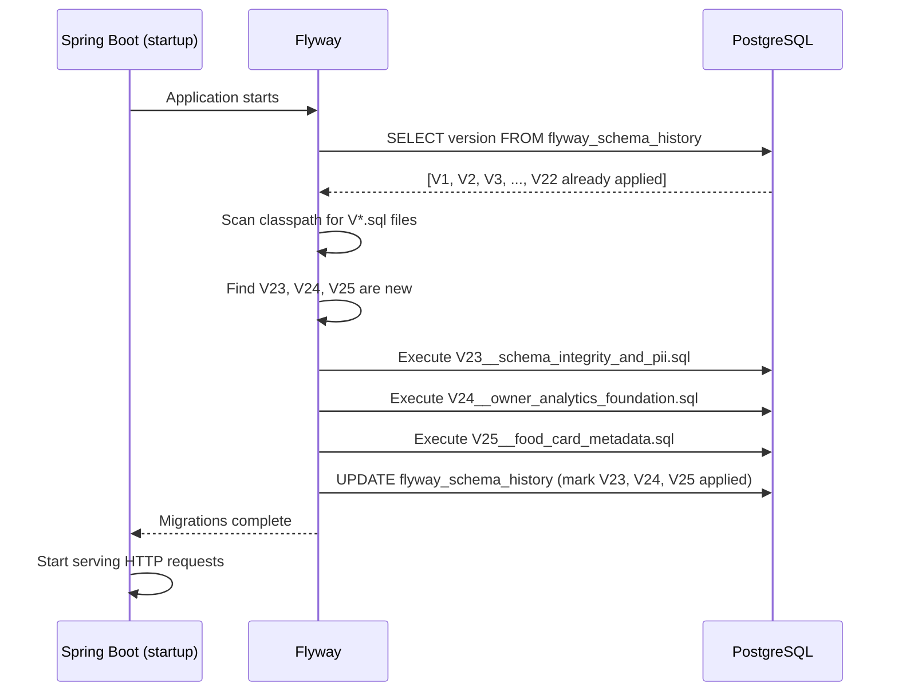

### PlatterOps Migration History

```
V1  → restaurants + users (tenant root)
V2  → menu_categories
V3  → menu_items (price in paise)
V4  → orders + order_items
V5  → restaurant status enum
V6  → updated_at trigger function (PL/pgSQL)
V7  → fssai_license + gst_number on restaurants
V8  → order_status_history
V9  → dining_tables + table_id FK on orders
V10 → operating_hours JSON on restaurants
V11 → payment fields on orders
V12 → audit_log table
V13 → customer guest fields on orders
V14 → notification preference flags
V15 → composite indexes + constraints
V16 → trigger refresh (idempotent)
V17 → DPDP deletion fields on users
V18 → reviews table
V19 → prep_time_minutes on menu_items
V20 → inventory table
V21 → subscriptions table
V22 → deleted_at on all entities (soft delete rollout)
V23 → CHECK constraints + partial unique indexes + PII fields
V24 → meal_period generated column + analytics views
V25 → FSSAI food card (allergens, nutrition, flavour tags)
```

### configuration in `application.yml`

```yaml
spring:
  flyway:
    locations: classpath:db/migration
    baseline-on-migrate: true    # safe if DB already has tables (won't fail)
  jpa:
    hibernate:
      ddl-auto: validate         # Hibernate VALIDATES schema matches entities but does NOT create/alter
```

`ddl-auto: validate` is critical — it means Flyway owns the schema, not Hibernate. If you add a field to a Java entity but forget to write a migration, the app fails to start with a validation error (not silently corrupt the DB).

### Why Not Just Use `ddl-auto: create-drop`?

`create-drop` deletes and recreates the entire database on every restart — all your data is gone. This is only okay for unit tests. In a real application, you'd lose all orders, users, and restaurant data. Flyway maintains the schema incrementally — data is preserved.

---

## 5. Kubernetes — Running in a Real Cluster

### What is Kubernetes?

Kubernetes (K8s) is a system that manages containers at scale. It answers questions like: "How do I run 3 copies of the backend? How do I restart it if it crashes? How do I update it without downtime?"

**Analogy:** Docker runs one container. Kubernetes is like a factory manager who decides how many containers to run, where to run them, restarts crashed ones, and routes traffic to healthy ones.

### PlatterOps Uses Kind (Kubernetes in Docker)

**Kind (Kubernetes IN Docker)** runs a full Kubernetes cluster inside Docker containers. It's used for local testing of Kubernetes manifests without needing a cloud provider.

```yaml
# k8s/kind/kind-config.yml
kind: Cluster
apiVersion: kind.x-k8s.io/v1alpha4
name: dineops
nodes:
  - role: control-plane        # one node — the brain of the cluster
    extraPortMappings:
      - containerPort: 80
        hostPort: 80            # forward host port 80 to cluster port 80
      - containerPort: 443
        hostPort: 443
```

### Kubernetes Architecture — PlatterOps Cluster

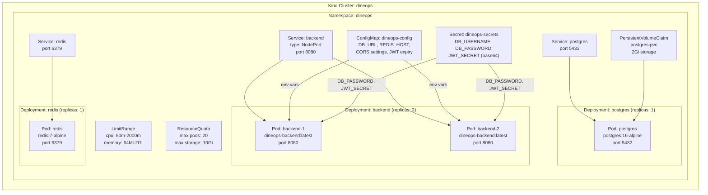

### Key Kubernetes Objects Explained

---

#### Deployment

A Deployment says: "I want 2 copies of this container running at all times."

```yaml
# k8s/backend.yaml
spec:
  replicas: 2          # always run 2 pods
  selector:
    matchLabels:
      app: backend     # manage pods with this label
  template:
    spec:
      containers:
        - name: backend
          image: dineops-backend:latest
          imagePullPolicy: Never   # use locally built image (Kind-specific)
```

If one pod crashes, Kubernetes immediately starts a replacement. If you update the image, Kubernetes does a **rolling update** — starts new pods before stopping old ones = zero downtime.

---

#### Service

A Service is a stable network endpoint that routes traffic to healthy pods. Without it, you'd have to track pod IPs manually (pods get new IPs when they restart).

```yaml
# k8s/backend.yaml
apiVersion: v1
kind: Service
spec:
  selector:
    app: backend       # route to pods with label app=backend
  ports:
    - port: 8080
      targetPort: 8080
  type: NodePort       # expose outside the cluster (for local Kind testing)
```

When frontend calls `http://backend:8080`, the Service load-balances between `backend-1` and `backend-2`.

---

#### ConfigMap vs Secret

```yaml
# k8s/config.yaml — ConfigMap (non-sensitive config)
data:
  DB_URL: jdbc:postgresql://postgres:5432/dineops
  REDIS_HOST: redis
  JWT_EXPIRATION_MS: "900000"
  CORS_ALLOWED_ORIGINS: "http://localhost:5173"
```

```yaml
# k8s/secret.example.yaml — Secret (sensitive, base64-encoded)
data:
  DB_USERNAME: ZGluZW9wcw==    # base64("dineops")
  DB_PASSWORD: <base64-encoded>
  JWT_SECRET: <base64-encoded>
```

**ConfigMap** = non-sensitive key-value pairs injected as environment variables.
**Secret** = same concept but stored encrypted in etcd (Kubernetes' key-value store). Never commit the actual `secret.yaml` to Git — only `secret.example.yaml`.

In the backend pod:
```yaml
env:
  - name: JWT_SECRET
    valueFrom:
      secretKeyRef:           # read from Secret
        name: dineops-secrets
        key: JWT_SECRET
  - name: DB_URL
    valueFrom:
      configMapKeyRef:        # read from ConfigMap
        name: dineops-config
        key: DB_URL
```

---

#### Readiness vs Liveness Probes

```yaml
# k8s/backend.yaml
readinessProbe:
  httpGet:
    path: /actuator/health    # calls Spring Actuator
    port: 8080
  initialDelaySeconds: 30     # wait 30s before first check (JVM startup time)
  periodSeconds: 10
  failureThreshold: 5

livenessProbe:
  httpGet:
    path: /actuator/health
    port: 8080
  initialDelaySeconds: 60     # longer — app might be healthy but slow to start
  periodSeconds: 30
  failureThreshold: 5
```

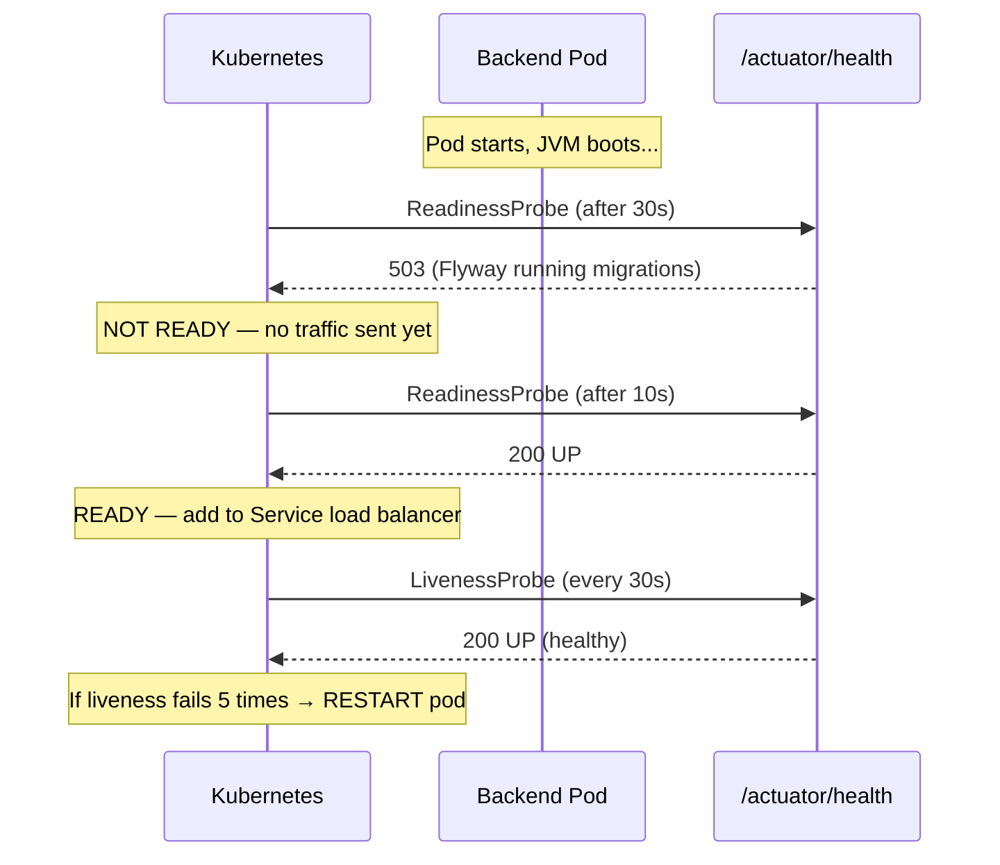

**Readiness** = "Is this pod ready to receive traffic?" (not ready → removed from load balancer)
**Liveness** = "Is this pod still alive?" (unhealthy → killed and restarted)

---

#### PersistentVolumeClaim (PVC)

```yaml
# k8s/postgres.yaml
apiVersion: v1
kind: PersistentVolumeClaim
metadata:
  name: postgres-pvc
spec:
  accessModes:
    - ReadWriteOnce    # can be mounted by ONE node at a time
  resources:
    requests:
      storage: 2Gi    # request 2GB of disk from the cluster
```

Pods are ephemeral — if a pod is deleted, its data is lost. A PVC requests storage from the cluster that **persists beyond pod lifetime**. PostgreSQL mounts this PVC so database data survives pod restarts.

---

#### LimitRange and ResourceQuota

```yaml
# k8s/resource-limits.yaml
kind: LimitRange           # default limits per container in the namespace
spec:
  limits:
    - type: Container
      defaultRequest:
        cpu: 100m          # "100 millicores" = 10% of one CPU core
        memory: 128Mi
      default:             # max if not specified
        cpu: 500m
        memory: 512Mi

kind: ResourceQuota        # total limits for the entire namespace
spec:
  hard:
    pods: "20"             # max 20 pods total
    requests.memory: 3Gi  # total memory requested across all pods
    requests.storage: 10Gi
```

`100m` CPU = 1/10 of one CPU core. The backend pod requests `200m` and has a limit of `1000m` (1 full core). If it tries to use more than 1 core, Kubernetes throttles it. If it uses more than `1024Mi` memory, Kubernetes kills it (OOMKilled).

---

## 6. Prometheus — Collecting Metrics

### What is Prometheus?

Prometheus is a **time-series database** that periodically calls your application's metrics endpoint and stores the numbers over time. Every 15 seconds it asks: "How many HTTP requests happened? What's the JVM heap usage? How many DB connections are open?"

### How Prometheus Scrapes PlatterOps

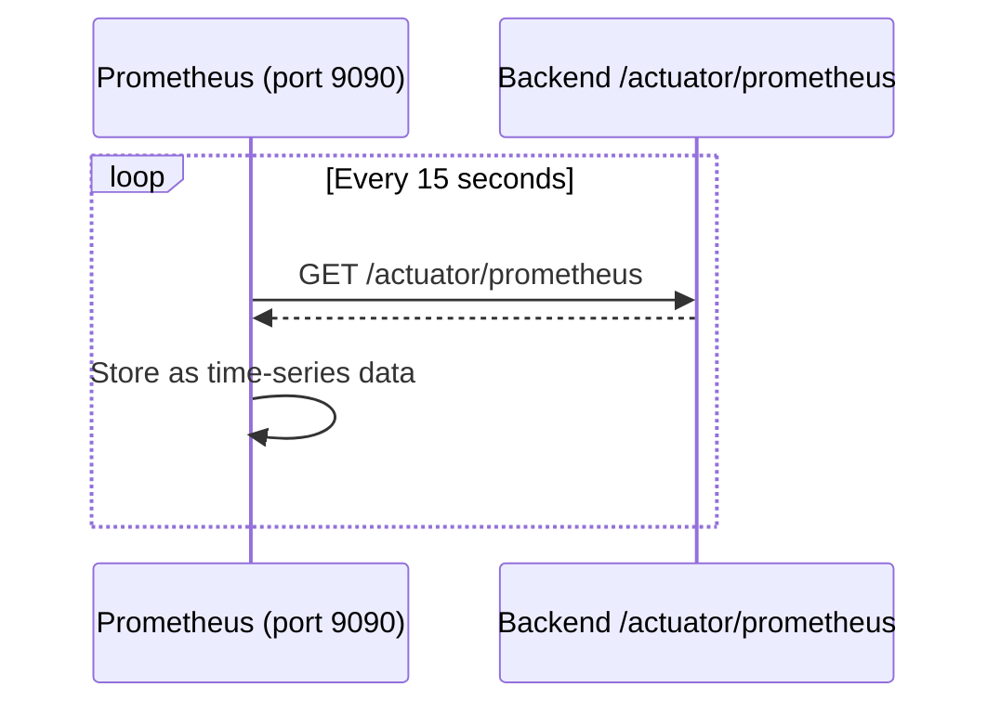

```yaml
# monitoring/prometheus.yml
global:
  scrape_interval: 15s            # pull metrics every 15 seconds

scrape_configs:
  - job_name: 'dineops-backend'
    metrics_path: '/actuator/prometheus'   # Spring Actuator exposes Prometheus-format metrics
    static_configs:
      - targets: ['backend:8080']          # "backend" = Docker Compose service name
```

### What Metrics Does Spring Actuator Expose?

Spring Boot's `spring-boot-starter-actuator` + `micrometer-registry-prometheus` automatically expose:

| Metric | What It Measures |
|---|---|
| `http_server_requests_seconds` | Latency + count per API endpoint |
| `jvm_memory_used_bytes` | JVM heap/non-heap memory |
| `jvm_gc_pause_seconds` | Garbage collection pause times |
| `hikaricp_connections_active` | Active DB connections in pool |
| `hikaricp_connections_pending` | Requests waiting for a DB connection |
| `process_cpu_usage` | CPU % used by the JVM |
| `spring_data_repository_invocations` | Repository call counts + timing |
| `cache_gets_total` | Redis cache hits vs misses |

Prometheus stores these as time series — you can query: "What was the 95th percentile response time for `POST /api/v1/orders` at 8 PM yesterday?"

---

## 7. Grafana — Visualising Metrics

### What is Grafana?

Grafana connects to Prometheus (and other data sources) and lets you build dashboards — graphs, gauges, tables — from the raw metric numbers.

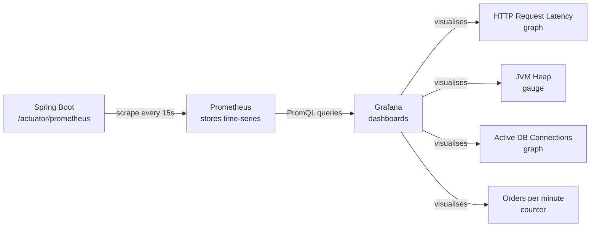

### Docker Compose Setup

```yaml
# docker-compose.yml
grafana:
  image: grafana/grafana:latest
  ports:
    - "3001:3000"    # access at http://localhost:3001
  environment:
    - GF_SECURITY_ADMIN_USER=${GF_SECURITY_ADMIN_USER}
    - GF_SECURITY_ADMIN_PASSWORD=${GF_SECURITY_ADMIN_PASSWORD}
  volumes:
    - grafana_data:/var/lib/grafana    # dashboards + data source config persisted
  depends_on:
    - prometheus
```

### Example PromQL Queries You Can Write in Grafana

```promql
# HTTP request rate (requests per second) to the orders endpoint
rate(http_server_requests_seconds_count{uri="/api/v1/orders", method="POST"}[5m])

# 95th percentile response time across all endpoints
histogram_quantile(0.95, rate(http_server_requests_seconds_bucket[5m]))

# Active HikariCP database connections
hikaricp_connections_active{pool="HikariPool-1"}

# Redis cache hit rate
rate(cache_gets_total{result="hit"}[5m]) /
rate(cache_gets_total[5m])

# JVM heap memory usage
jvm_memory_used_bytes{area="heap"} / jvm_memory_max_bytes{area="heap"} * 100
```

---

## 8. k6 — Load & Smoke Testing

### What is k6?

k6 is a load testing tool — it simulates multiple users hitting your API at the same time to check:
- Does it stay fast under load?
- Does it crash at high concurrency?
- Where is the bottleneck?

### Two Test Types in PlatterOps

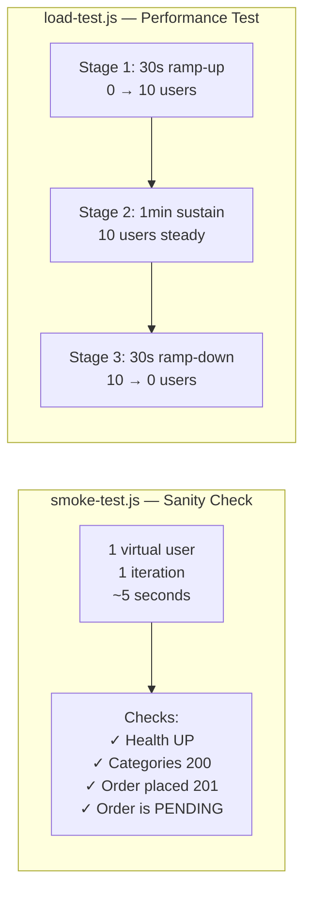

### Smoke Test (`k6/smoke-test.js`)

Runs with 1 user, 1 time. Used after every deployment to confirm the app is alive.

```javascript
export const options = {
  vus: 1,         // 1 virtual user
  iterations: 1,  // run once
};

export default function () {
  // 1. Health check
  const health = http.get(`${API_ORIGIN}/actuator/health`);
  check(health, { 'Health UP': (r) => r.status === 200 });

  // 2. Menu categories
  const cats = http.get(`${API_BASE_URL}/restaurants/${TENANT_ID}/categories`);
  check(cats, {
    'Categories 200': (r) => r.status === 200,
    'Has categories': (r) => JSON.parse(r.body).length > 0,
  });

  // 3. Place order
  const order = http.post(`${API_BASE_URL}/orders`, JSON.stringify({
    tenantId: TENANT_ID,
    items: [{ menuItemId: MENU_ITEM_ID, quantity: 1 }]
  }), { headers: { 'Content-Type': 'application/json' } });

  check(order, {
    'Order placed 201': (r) => r.status === 201,
    'Order has ID':     (r) => JSON.parse(r.body).id !== undefined,
    'Order is PENDING': (r) => JSON.parse(r.body).status === 'PENDING',
  });
}
```

### Load Test (`k6/load-test.js`)

Ramps up to 10 concurrent users and enforces performance thresholds.

```javascript
export const options = {
  stages: [
    { duration: '30s', target: 10 },  // ramp up
    { duration: '1m',  target: 10 },  // sustain
    { duration: '30s', target: 0  },  // ramp down
  ],
  thresholds: {
    // If any threshold fails, k6 exits with error code 1 (fails CI)
    http_req_duration:         ['p(95)<500'],   // 95% of requests < 500ms
    error_rate:                ['rate<0.05'],   // error rate < 5%
    order_placement_duration:  ['p(95)<1000'],  // order placement < 1s
  },
};
```

**Custom metrics:**

```javascript
const errorRate = new Rate('error_rate');           // percentage of failed checks
const orderDuration = new Trend('order_placement_duration');  // custom timing

// Track order placement time
const orderStart = Date.now();
const orderRes = http.post(...);
orderDuration.add(Date.now() - orderStart);   // adds one data point to the Trend
```

### Running k6

```bash
# Smoke test
k6 run k6/smoke-test.js

# Load test
k6 run k6/load-test.js

# Against a different environment
K6_BASE_URL=https://staging.dineops.com/api/v1 k6 run k6/load-test.js
```

### What the k6 Output Looks Like

```
✓ Health UP
✓ Categories 200
✓ Place Order status 200
✓ Place Order has id

checks.........................: 100.00% ✓ 247  ✗ 0
data_received..................: 1.2 MB
http_req_duration..............: avg=124ms  min=43ms  med=98ms  max=421ms p(90)=213ms p(95)=289ms
error_rate.....................: 0.00%
order_placement_duration.......: avg=198ms  p(95)=412ms  ✓ < 1000ms
```

If `p(95) > 500ms` → k6 exits with code 1 → CI pipeline fails → merge is blocked.

---

## 9. GitHub Actions — CI/CD Pipeline

### What is GitHub Actions?

GitHub Actions runs automated workflows triggered by Git events (push, pull request). PlatterOps uses it to run tests automatically on every push.

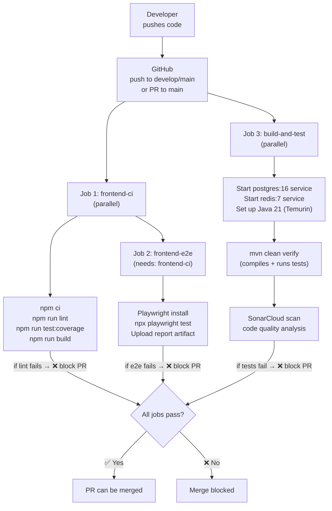

### The CI File Explained (`.github/workflows/ci.yml`)

**Trigger:**
```yaml
on:
  push:
    branches: [ develop, main ]   # runs on every push to develop or main
  pull_request:
    branches: [ main ]            # runs on every PR targeting main
```

**Services (spin up dependencies for tests):**
```yaml
jobs:
  build-and-test:
    services:
      postgres:
        image: postgres:16
        env:
          POSTGRES_DB: dineops
          POSTGRES_USER: dineops
          POSTGRES_PASSWORD: dineops123
        options: >-
          --health-cmd pg_isready
          --health-interval 10s
          --health-retries 5
      redis:
        image: redis:7
        options: >-
          --health-cmd "redis-cli ping"
```

GitHub Actions spins up real PostgreSQL and Redis containers alongside the test runner. This is exactly like Docker Compose but in CI. Flyway runs during `mvn clean verify` and creates the full schema — tests run against a real database.

**Backend test + coverage:**
```yaml
- name: Build, test, and enforce backend coverage
  working-directory: backend
  run: ./mvnw clean verify -q
  # "verify" runs: compile → test → jacoco coverage check
  # If coverage drops below threshold → fails
```

**SonarCloud:**
```yaml
- name: SonarCloud scan
  run: ./mvnw sonar:sonar -Dsonar.projectKey=dsouzasharon2k_PlatterOps
  # Sends test results + coverage report to SonarCloud
  # SonarCloud checks for: bugs, vulnerabilities, code smells, coverage
```

**Playwright E2E:**
```yaml
- name: Install Playwright browsers
  run: npx playwright install --with-deps chromium firefox

- name: Run frontend E2E tests
  run: npm run test:e2e
  # Playwright opens a real browser, navigates the app, clicks buttons
  # If the login flow breaks → test fails → PR blocked
```

---

## 10. Interview Questions on Every Tool

---

### Docker Questions

---

**Q: What is the difference between a Docker image and a Docker container?**

An **image** is a read-only, static template — the compiled app packaged with all its dependencies (Java runtime, the JAR, OS libraries). Stored in a registry.

A **container** is a running instance of an image. It has its own filesystem (copy-on-write from the image), its own network interface, and its own process namespace. Multiple containers can run from the same image simultaneously.

In PlatterOps: `docker build -t dineops-backend .` creates an image. `docker run dineops-backend` creates a container from that image. The docker-compose.yml runs 6 containers from different images simultaneously.

---

**Q: What is a multi-stage Docker build? Why did you use it?**

A multi-stage build uses multiple `FROM` statements. Each stage can copy artifacts from the previous stage. Only the final stage becomes the actual image.

PlatterOps backend has two stages:
1. **Build stage** (`eclipse-temurin:21-jdk-alpine`) — has the full JDK, Maven, and source code. Compiles the JAR.
2. **Runtime stage** (`eclipse-temurin:21-jre-alpine`) — has only the JRE. Copies just the JAR from stage 1.

Result: the final image is ~200MB instead of ~600MB because it doesn't include the JDK, Maven, or source files. Smaller images pull faster and have a smaller attack surface.

---

**Q: How do containers communicate with each other in Docker Compose?**

Docker Compose creates a shared network for all services. Services can reach each other by their **service name** as the hostname.

In PlatterOps: the backend reaches PostgreSQL at `postgres:5432` (not `localhost:5432`). This is because Docker's internal DNS resolves the service name `postgres` to that container's IP. The backend's environment variable is:
```
SPRING_DATASOURCE_URL: jdbc:postgresql://postgres:5432/${POSTGRES_DB}
```

---

**Q: What is a Docker volume? Why does PlatterOps use named volumes?**

A Docker volume is a directory on the host machine that's mounted into a container. Data written to the volume path persists even after the container is stopped or deleted.

PlatterOps uses named volumes (`postgres_data`, `redis_data`, `grafana_data`, `prometheus_data`). If you `docker-compose down` and `docker-compose up` again, the database data is still there. Without a volume, every `docker-compose down` would lose all data — you'd start with an empty database every time.

---

**Q: Why does PlatterOps run the backend container as a non-root user?**

In `backend/Dockerfile`:
```dockerfile
RUN addgroup -S app && adduser -S app -G app
USER app
```

Running as root inside a container is a security risk. If the application has a vulnerability and an attacker gains code execution, they'd have root access inside the container — making container escape attacks easier. Running as a non-root user limits the blast radius.

---

### Kubernetes Questions

---

**Q: What is Kubernetes? Why would you use it over plain Docker?**

Kubernetes orchestrates containers at scale. It handles:
- **Self-healing:** If a pod crashes, Kubernetes restarts it automatically
- **Scaling:** Increase replicas with one command; HPA does it automatically based on CPU
- **Rolling updates:** Deploy new versions without downtime — new pods start before old ones stop
- **Service discovery:** Services get stable DNS names regardless of pod IP changes
- **Secret management:** Sensitive data stored encrypted in etcd

Plain Docker: you manually start containers. If one crashes, it stays crashed. No built-in load balancing between instances.

PlatterOps runs 2 backend replicas — if one crashes at 3 AM, Kubernetes starts a replacement immediately, and the other replica keeps serving traffic the whole time.

---

**Q: What is the difference between a Deployment and a Pod?**

A **Pod** is the smallest deployable unit — one or more containers sharing a network and storage. Pods are ephemeral; if they die, they're not automatically replaced.

A **Deployment** manages Pods. It declares "I want 2 replicas of this pod." If a pod dies, the Deployment controller creates a new one. Deployments also handle rolling updates — gradually replacing old pods with new ones.

In PlatterOps:
- `k8s/backend.yaml` defines a Deployment with `replicas: 2`
- The Deployment controller ensures 2 backend pods are always running
- You never interact with individual pods directly in normal operations

---

**Q: What is the difference between readiness probe and liveness probe?**

| Probe | Question | Action on Failure |
|---|---|---|
| **Readiness** | "Is this pod ready to receive traffic?" | Remove from Service load balancer (but don't restart) |
| **Liveness** | "Is this pod still alive and functional?" | Kill the pod and restart it |

In PlatterOps, the backend takes ~30-60 seconds to start (JVM warm-up + Flyway migrations). During startup, the readiness probe fails — so Kubernetes keeps traffic on the old pod while the new one warms up. Once `/actuator/health` returns 200, the new pod enters the load balancer rotation. Liveness checks continue every 30s; if the app deadlocks, liveness fails → pod is killed → new pod starts.

---

**Q: What is a ConfigMap vs a Secret in Kubernetes?**

**ConfigMap:** Stores non-sensitive key-value pairs. Data is stored in plain text in etcd. In PlatterOps: `DB_URL`, `REDIS_HOST`, `CORS_ALLOWED_ORIGINS`, JWT expiry times.

**Secret:** Stores sensitive data. Values are base64-encoded (not encrypted by default, but can be encrypted at rest). Access is controlled by RBAC. In PlatterOps: `DB_PASSWORD`, `JWT_SECRET`, `DB_USERNAME`.

Both are injected as environment variables into pods:
```yaml
env:
  - name: JWT_SECRET
    valueFrom:
      secretKeyRef:        # from Secret
        name: dineops-secrets
        key: JWT_SECRET
  - name: DB_URL
    valueFrom:
      configMapKeyRef:     # from ConfigMap
        name: dineops-config
        key: DB_URL
```

The actual `secret.yaml` file is in `.gitignore` — never commit real secrets to Git.

---

**Q: What is a PersistentVolumeClaim? Why does PostgreSQL need one?**

A PVC is a request for storage from the cluster. Pods are ephemeral — if the PostgreSQL pod is deleted, all its data is lost. A PVC provisions a persistent disk that exists independently of any pod. When the new pod starts, it mounts the same PVC and finds all its data intact.

PlatterOps uses `postgres-pvc` with `storage: 2Gi` and `accessModes: ReadWriteOnce` (can only be mounted by one node at a time, which is fine for PostgreSQL — it's not designed for multi-node writes).

---

**Q: What is a Namespace in Kubernetes?**

A Namespace is a virtual cluster inside a physical cluster. It provides isolation — resources in one namespace can't accidentally collide with resources in another.

PlatterOps uses namespace `dineops`:
```yaml
# k8s/namespace.yaml
kind: Namespace
metadata:
  name: dineops
```

All resources (Deployments, Services, ConfigMaps, Secrets, PVCs) live in the `dineops` namespace. Commands use `-n dineops`:
```bash
kubectl get pods -n dineops
kubectl logs -n dineops deployment/backend
kubectl apply -f k8s/ -n dineops
```

---

**Q: What is a LimitRange and ResourceQuota?**

**LimitRange:** Sets default and maximum CPU/memory for every container in a namespace. Prevents one poorly-configured container from consuming all cluster resources.

PlatterOps sets default container limits of `500m` CPU and `512Mi` memory. If a developer forgets to set limits on a new container, these defaults apply automatically.

**ResourceQuota:** Hard cap on total resources the entire namespace can use. PlatterOps limits the `dineops` namespace to 20 pods, 5Gi total memory, 10Gi total storage — preventing runaway resource consumption.

---

### Flyway Questions

---

**Q: What is Flyway and why is it better than `ddl-auto: create`?**

Flyway is a database migration tool that applies versioned SQL scripts in order. It tracks applied migrations in a `flyway_schema_history` table.

`ddl-auto: create` tells Hibernate to drop and recreate tables on every startup — all data is lost every restart. `ddl-auto: create-drop` is even worse — it drops tables on shutdown.

Flyway with `ddl-auto: validate`:
- Schema is built incrementally — existing data is preserved
- Hibernate only validates that entities match the schema (fails fast if you forgot a migration)
- Every environment runs the exact same migrations in the exact same order
- Migrations are code-reviewed and version-controlled in Git

---

**Q: What happens if two developers write migration V5 at the same time?**

This is a real problem. If two developers write `V5__add_column.sql` independently:

1. Git merge conflict is likely — caught before merge
2. If somehow both land in main, Flyway will execute one V5 and reject the other (checksum mismatch)

The convention is: check the highest existing migration number before writing a new one, and communicate with the team. Some teams use Flyway's `repeatable` migrations (`R__`) for non-versioned scripts.

In PlatterOps, the highest migration is V25. Any new schema change becomes V26.

---

**Q: What is `baseline-on-migrate: true` in your Flyway config?**

```yaml
spring.flyway.baseline-on-migrate: true
```

If Flyway starts and finds an existing database with no `flyway_schema_history` table, normally it would fail — it doesn't know what's already applied. `baseline-on-migrate: true` creates the history table and marks the current state as the baseline. New migrations (V26+) are then applied going forward.

This is useful when migrating an existing production database to Flyway management for the first time.

---

### Prometheus & Grafana Questions

---

**Q: What is the pull model in Prometheus? How is it different from push?**

**Pull (Prometheus model):** Prometheus actively calls `/actuator/prometheus` on the backend every 15 seconds and reads the current metrics. The application doesn't need to know about Prometheus.

**Push (alternative):** The application sends metrics to a central collector (e.g., StatsD). The app must be configured with the collector's address.

**Why pull is better for PlatterOps:**
- The backend doesn't need any Prometheus-specific code (just expose the endpoint)
- Prometheus can detect if a target is down (no scrape = target is down)
- Easy to add new scrape targets without changing the application

---

**Q: What metrics did you monitor from your Spring Boot backend?**

Via Spring Actuator + Micrometer (auto-configured):

1. **HTTP request rate and latency** — `http_server_requests_seconds` — how fast is each endpoint?
2. **JVM memory** — `jvm_memory_used_bytes` — is the heap growing (memory leak)?
3. **GC pauses** — `jvm_gc_pause_seconds` — how often is garbage collection hurting performance?
4. **Database connection pool** — `hikaricp_connections_active` — are we running out of DB connections?
5. **Cache hit rate** — `cache_gets_total{result="hit"}` — is Redis actually reducing DB load?
6. **CPU usage** — `process_cpu_usage` — are we CPU-bound?

In Grafana, you'd visualise these on a dashboard to see at a glance whether the system is healthy.

---

**Q: What is PromQL? Give an example.**

PromQL (Prometheus Query Language) is used to query metric data.

```promql
# Rate of HTTP requests per second to POST /orders over last 5 minutes
rate(http_server_requests_seconds_count{
  uri="/api/v1/orders",
  method="POST"
}[5m])

# 95th percentile latency for all API calls
histogram_quantile(0.95,
  rate(http_server_requests_seconds_bucket[5m])
)

# Cache hit percentage
(rate(cache_gets_total{result="hit"}[5m]) /
 rate(cache_gets_total[5m])) * 100
```

`rate()` calculates per-second rate over a time window. `histogram_quantile()` calculates percentiles from histogram buckets.

---

### k6 Questions

---

**Q: What is the difference between a smoke test and a load test?**

| | Smoke Test | Load Test |
|---|---|---|
| Purpose | "Does it work at all?" | "How does it perform under pressure?" |
| Users | 1 virtual user | 10+ virtual users with ramp stages |
| Duration | Seconds | Minutes |
| When run | After every deploy | On-demand or weekly |
| PlatterOps | `k6/smoke-test.js` | `k6/load-test.js` |

The smoke test catches obvious breakages (wrong URL, DB not connected, migration failed). The load test finds performance regressions (endpoint gets slow under concurrency, connection pool exhausted, memory leak over time).

---

**Q: What are k6 thresholds? What happens if they fail?**

Thresholds define pass/fail criteria for your performance tests:

```javascript
thresholds: {
  http_req_duration:        ['p(95)<500'],   // 95% of all requests must complete < 500ms
  error_rate:               ['rate<0.05'],   // fewer than 5% of requests can fail
  order_placement_duration: ['p(95)<1000'],  // 95% of order placements < 1 second
}
```

If any threshold is violated, k6 exits with exit code 1. In CI, this means the job fails. If this is a required check on a PR, the merge is blocked. This automates performance regression detection.

---

**Q: What are the stages in your load test?**

```javascript
stages: [
  { duration: '30s', target: 10 },  // ramp-up: 0 → 10 concurrent users over 30 seconds
  { duration: '1m',  target: 10 },  // sustain: hold 10 users for 1 minute
  { duration: '30s', target: 0  },  // ramp-down: 10 → 0 users over 30 seconds
]
```

The ramp-up simulates realistic traffic growth (real users don't all arrive simultaneously). The sustain period reveals steady-state behavior — memory leaks appear here if resources grow over time. The ramp-down confirms graceful handling of decreasing load.

---

**Q: What does `p(95)<500` mean?**

`p(95)` is the 95th percentile — the value below which 95% of measurements fall. `p(95)<500` means: "At least 95% of all HTTP requests must complete in under 500ms."

Why 95th percentile and not average? Averages hide outliers. If 99 requests take 10ms and 1 takes 5000ms, the average is ~60ms — looks fine! But 1% of users waited 5 seconds. The 95th or 99th percentile reveals what "slow" users actually experience.

---

### CI/CD Pipeline Questions

---

**Q: What is a CI/CD pipeline? What does yours do?**

**CI (Continuous Integration):** Every code push automatically runs tests. Prevents broken code from entering the main branch.

**CD (Continuous Delivery):** Automatically build and package the application after successful tests. A deployment step may be manual or fully automated.

PlatterOps CI pipeline (`.github/workflows/ci.yml`) on every PR to main:

1. **frontend-ci** — installs deps, lints, runs unit tests with coverage, builds the React app
2. **frontend-e2e** — runs Playwright browser tests (real browser clicks through the UI)
3. **build-and-test** — starts PostgreSQL + Redis as Docker services, runs `mvn clean verify` (unit + integration tests), runs SonarCloud code quality scan

If any step fails, the PR cannot be merged. This ensures main always has passing tests.

---

**Q: What is SonarCloud? Why did you integrate it?**

SonarCloud is a static code analysis service. It analyzes source code after tests and reports:
- **Bugs** — code that will likely cause runtime errors
- **Vulnerabilities** — security issues (e.g., SQL injection risk, hardcoded credentials)
- **Code smells** — maintainability issues (overly complex methods, duplicate code)
- **Coverage** — what percentage of code is covered by tests

```yaml
- name: SonarCloud scan
  run: ./mvnw sonar:sonar
       -Dsonar.projectKey=dsouzasharon2k_PlatterOps
       -Dsonar.organization=dsouzasharon2k
       -Dsonar.host.url=https://sonarcloud.io
```

Integrated into CI so every PR's code quality is checked before merge — not just functionality but cleanliness and security.

---

**Q: Why are PostgreSQL and Redis started as "services" in the GitHub Actions job?**

```yaml
jobs:
  build-and-test:
    services:
      postgres:
        image: postgres:16
        options: --health-cmd pg_isready --health-interval 10s
      redis:
        image: redis:7
        options: --health-cmd "redis-cli ping"
```

The backend's integration tests (`@SpringBootTest`) need a real database and Redis — they can't use mocks for everything. GitHub Actions `services` spin up Docker containers alongside the test runner, exposing them at `localhost:5432` and `localhost:6379`.

Flyway runs during application startup in tests, creating the full schema. Tests run against a real database, catching real bugs (constraint violations, migration issues) that unit tests with mocks would miss.

---

**Q: What is the difference between CI and CD?**

**CI (Continuous Integration):**
- Triggered on every push/PR
- Runs tests, linting, static analysis
- Goal: catch broken code before it reaches main
- PlatterOps: GitHub Actions runs tests on every push

**CD (Continuous Delivery):**
- Triggered after CI succeeds on main
- Builds Docker images, pushes to registry
- Deploys to staging/production (possibly with a manual approval gate)
- PlatterOps: The CI pipeline builds and tests — deployment to Kubernetes would be the CD step (triggered manually or by tagging a release)

---

**Q: How would you handle a deployment failure at the last moment before production?**

In Kubernetes: if the new backend pod's readiness probe fails, the rolling update stops. Old pods continue serving traffic. Kubernetes never fully replaces old pods until the new ones are healthy.

If you realize a deployment broke something after it went live:
```bash
kubectl rollout undo deployment/backend -n dineops
# Kubernetes immediately reverts to the previous pod spec
# Old pods come back up; new broken pods are removed
```

Flyway migrations are the tricky part — you can't "undo" a migration automatically. The solution: write new migrations (V26) to revert schema changes, never edit or delete old ones.

---

*Last updated: March 2026*
*All code examples reference real files in the PlatterOps repository.*
