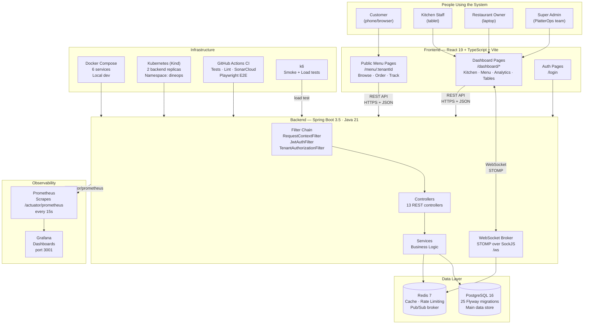
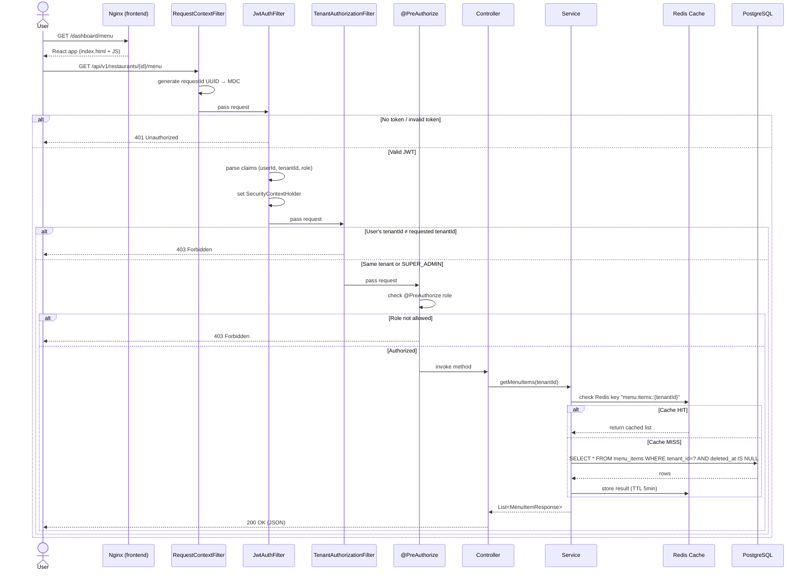
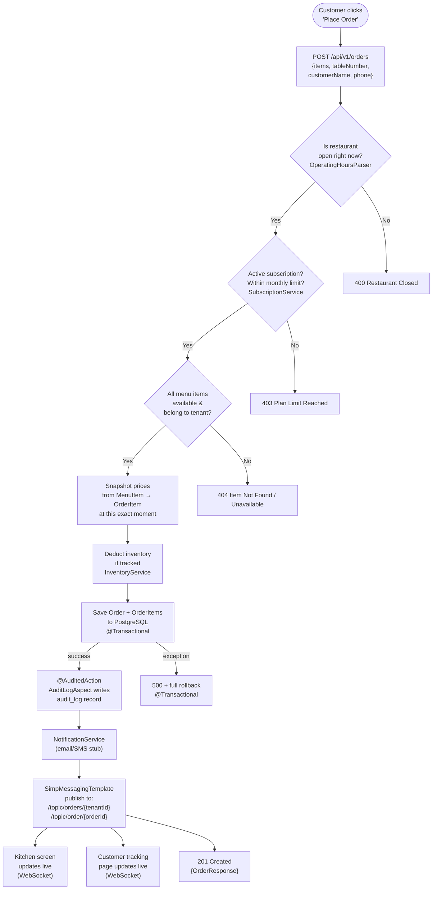
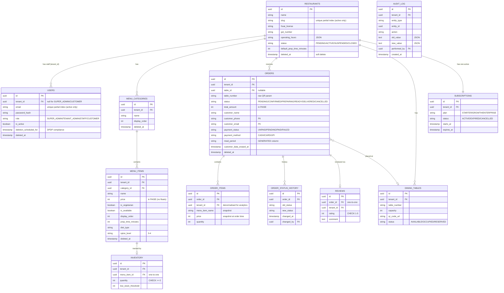
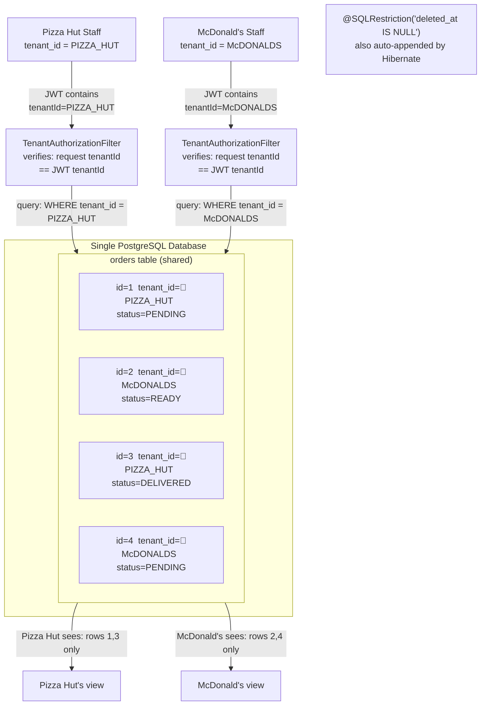
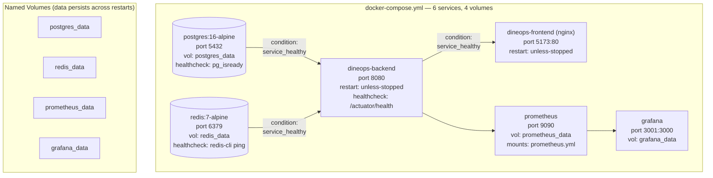
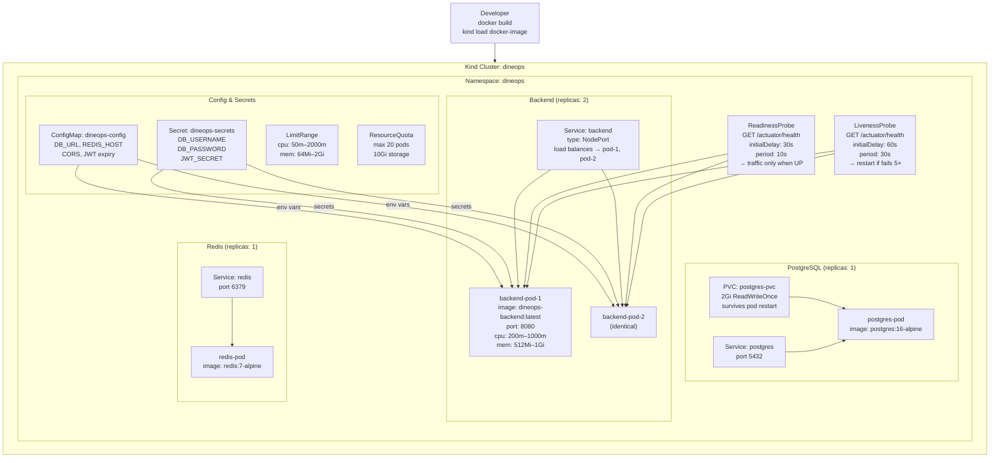
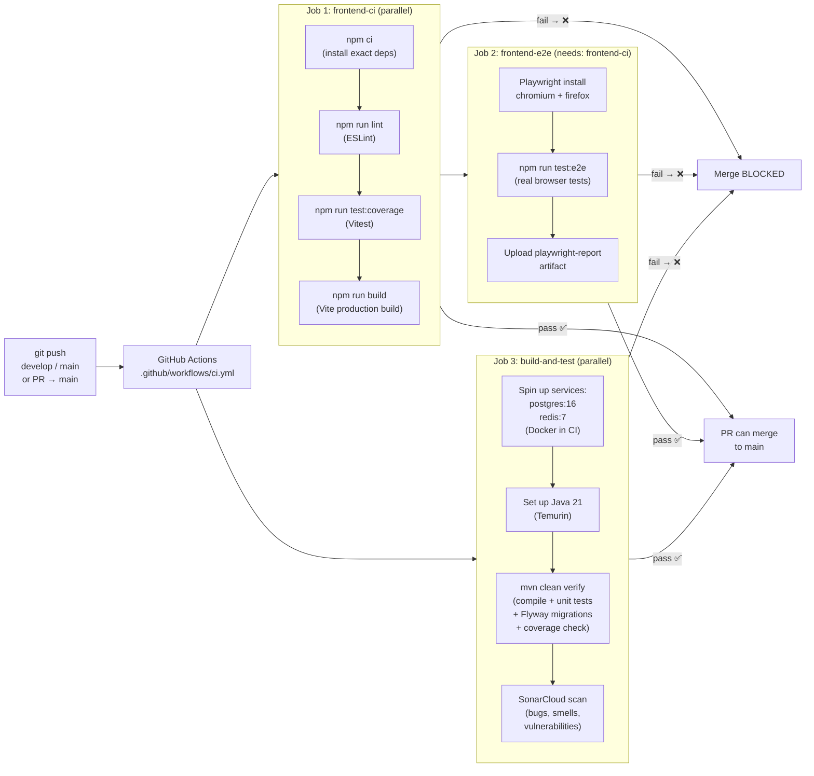
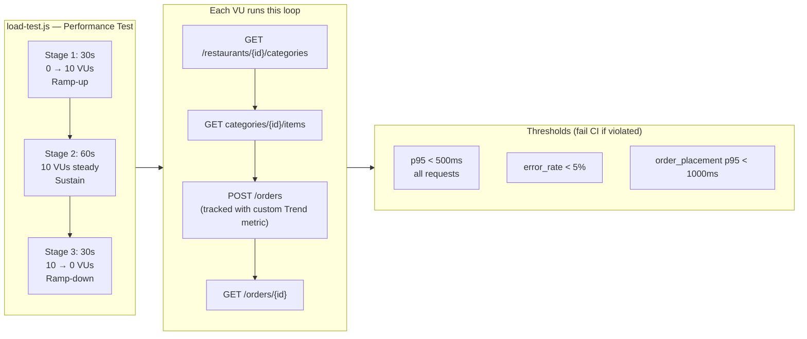

# PlatterOps — Architecture Diagrams & How to Explain the Project

> Two audiences. Same project. Completely different explanations.
> Use this file to prepare for interviews, demos, and technical discussions.

---

## Table of Contents

1. [Full Architecture Diagrams](#1-full-architecture-diagrams)
2. [Explaining to a Fresher](#2-explaining-to-a-fresher)
3. [Explaining to a Senior Developer](#3-explaining-to-a-senior-developer)

---

## 1. Full Architecture Diagrams

---

### 1.1 — The Complete System (Everything at Once)



---

### 1.2 — Every HTTP Request's Journey (Filter Chain)



---

### 1.3 — Order Placement (The Most Complex Flow)



---

### 1.4 — JWT Authentication (Login → Token → Request → Refresh)

```mermaid
sequenceDiagram
    actor U as User (Browser)
    participant FE as React Frontend
    participant BE as Spring Boot Backend
    participant RD as Redis
    participant DB as PostgreSQL

    Note over U,DB: ─── LOGIN ───
    U->>FE: enter email + password
    FE->>BE: POST /api/v1/auth/login
    BE->>RD: check auth:lock:{email} (account locked?)
    RD-->>BE: not locked
    BE->>RD: INCR auth:rate:{email} (rate limit: 10/min)
    RD-->>BE: count = 1, set EXPIRE 60s
    BE->>DB: SELECT * FROM users WHERE email = ?
    DB-->>BE: User row (passwordHash)
    BE->>BE: BCrypt.matches(rawPw, hash)
    BE->>BE: generate ACCESS TOKEN (24h) + REFRESH TOKEN (7d)
    BE-->>FE: 200 { accessToken } + Set-Cookie: refresh=...; HttpOnly; SameSite=Lax
    FE->>FE: store accessToken in JS memory ONLY (never localStorage)

    Note over U,DB: ─── API REQUEST ───
    U->>FE: navigate to /dashboard/menu
    FE->>BE: GET /api/v1/restaurants/{id}/menu\nAuthorization: Bearer {accessToken}
    BE->>BE: JwtAuthFilter validates token\nextracts userId, tenantId, role
    BE->>BE: TenantAuthorizationFilter checks tenantId match
    BE-->>FE: 200 OK (menu data)

    Note over U,DB: ─── TOKEN REFRESH (silent) ───
    FE->>BE: any API call → 401 (token expired)
    FE->>BE: POST /api/v1/auth/refresh\n(browser auto-sends HttpOnly cookie)
    BE->>BE: validate refresh token (tokenType claim)
    BE->>BE: generate new ACCESS + REFRESH tokens
    BE-->>FE: 200 { newAccessToken } + new Set-Cookie
    FE->>FE: update in-memory token
    FE->>BE: retry original request with new token
    BE-->>FE: 200 OK (original response)

    Note over U,DB: ─── LOGOUT ───
    U->>FE: click logout
    FE->>BE: POST /api/v1/auth/logout
    BE-->>FE: Set-Cookie: refresh=; Max-Age=0 (delete cookie)
    FE->>FE: clear in-memory token
```

---

### 1.5 — Database Schema (Core Relationships)



---

### 1.6 — Redis: Two Jobs in One

```mermaid
graph LR
    subgraph REDIS["Redis 7"]
        subgraph CACHE["Job 1: Application Cache"]
            C1["menu:items::{tenantId}\nTTL 5min"]
            C2["orders:by-id::{orderId}\nTTL 5min"]
            C3["orders:active-by-tenant::{tenantId}\nTTL 5min"]
        end

        subgraph RATELIMIT["Job 2: Rate Limiting & Lockout"]
            R1["auth:rate:{email}\nINCR + EXPIRE 60s\nmax 10 logins/min"]
            R2["auth:lock:{email}\nTTL 900s (15min)\nafter 5 failures"]
            R3["auth:failed:{email}\ncounter, reset on success"]
        end

        subgraph PUBSUB["Job 3: WebSocket Pub/Sub (future scale-out)"]
            P1["/topic/orders/{tenantId}\nKitchen board feed"]
            P2["/topic/order/{orderId}\nCustomer tracking"]
        end
    end

    SVC["OrderService\nMenuItemService"] -->|"@Cacheable\n@CacheEvict"| CACHE
    AUTH["AuthController\nRateLimitService\nAccountLockoutService"] --> RATELIMIT
    WS_BROKER["SimpMessagingTemplate"] --> PUBSUB
    PUBSUB --> KITCHEN["Kitchen Screen\n(browser WebSocket)"]
    PUBSUB --> CUST["Customer Phone\n(browser WebSocket)"]
```



---

### 1.7 — Multi-Tenancy: How Data Isolation Works



---

### 1.8 — Docker Compose: Local Dev Stack



---

### 1.9 — Kubernetes Cluster (Kind)



---

### 1.10 — CI/CD Pipeline (GitHub Actions)



---

### 1.11 — k6 Load Test Stages



---

## 2. Explaining to a Fresher

> Use this when talking to someone who just started learning programming.
> Simple words. Real-world analogies. No jargon without explanation.

---

### The One-Line Pitch

> "I built an app that lets restaurants manage their menus, orders, and staff — and multiple restaurants can use the same app, like how multiple shops can all use Shopify."

---

### The Restaurant Analogy (Explain the Whole System)

Imagine you walk into a restaurant. Here's what my app does, mapped to people in that restaurant:

| Role | In real life | In my app |
|---|---|---|
| Customer | Scans QR code, orders food | Uses the **Public Menu Page** on their phone |
| Waiter | Takes the order to the kitchen | The **React Frontend** passes data to the backend |
| Kitchen | Cooks the food, marks it done | The **Kitchen Screen** — live-updating board |
| Manager | Manages menu, sees reports | The **Dashboard** — analytics, inventory |
| Accountant | Tracks stock, bills | **Inventory + Subscription** modules |
| Security guard | Checks who you are at the door | **JWT Auth + Security Filters** |
| Whiteboard | Quick reminders for the team | **Redis Cache** |
| Filing cabinet | Permanent records | **PostgreSQL Database** |

---

### Frontend — "The Face of the App"

**What it is:** A website built with React. React is like building with LEGO — you build small pieces (components) and put them together to make pages.

**What it does:**
- Shows the menu to customers (public pages — no login needed)
- Shows a live kitchen board to staff (WebSocket = live updates without refreshing)
- Shows analytics and management tools to restaurant owners

**The magic part — live updates:**
Normally a website has to keep asking "anything new?" every few seconds. My app uses **WebSocket** — like a walkie-talkie. When a new order comes in, the server immediately shouts to the kitchen screen and the customer's phone. No delay, no constant asking.

**State management — Zustand:**
Think of it like a shared whiteboard that all components can read and write to. The shopping cart is on this whiteboard — when you add an item on one page, the cart count on another page updates automatically.

---

### Backend — "The Brain"

**What it is:** A Java program that listens for requests from the frontend, processes them, and talks to the database. Built with Spring Boot (a popular Java framework that handles a lot of boring setup for you).

**Every request goes through 3 layers, like a restaurant kitchen:**

```
Controller = the order window (takes requests from outside)
Service    = the chef (does the actual cooking / logic)
Repository = the pantry (gets/stores ingredients from the database)
```

**The security door:** Before any request reaches the controller, it passes through filters — like bouncers checking your wristband. First check: "are you logged in?" Second check: "do you belong to this restaurant?"

---

### Database — "The Memory"

**What it is:** PostgreSQL — like Excel, but much more powerful and reliable. It stores everything: restaurants, users, orders, menu items.

**The cool part — Flyway:**
Instead of someone manually setting up the database, I wrote numbered SQL files (`V1.sql`, `V2.sql`... all the way to `V25.sql`). When the app starts, it automatically runs any new files. It's like Git — but for the database structure.

**Soft deletes:**
When something is "deleted" (like a menu item), I don't actually remove it from the database. I just mark it with a timestamp saying "deleted at this time." Why? Because old orders might reference that item. If you actually deleted it, the order history would break.

**Prices in paise:**
Computers are bad at decimal math. `0.1 + 0.2` equals `0.30000000000000004` on a computer — not 0.3. For money, that's a real bug. So I store ₹99.50 as `9950` (an integer). No decimals, no bugs.

---

### Testing — "Making Sure Nothing Breaks"

**3 levels of testing:**

1. **Unit tests** — test one function at a time. Like testing that a calculator's `add()` function works correctly before building the whole calculator.

2. **Integration tests** — test the whole flow together. Does the login endpoint actually create a JWT? Does placing an order actually save to the database?

3. **E2E tests (Playwright)** — opens a real browser and clicks through the app like a real user. Like having a robot test your app.

**k6 load tests** — pretend 10 people are using the app at the same time and check that it stays fast. Like stress-testing a bridge by driving 10 cars across simultaneously.

---

### DevOps — "Getting It Running Everywhere"

**Docker:** Package the app into a box (image) that runs the same everywhere. Like a lunchbox — pack your food at home, open it at work, it's the same food.

**Docker Compose:** One command to start all 6 services (database, backend, frontend, Redis, Prometheus, Grafana) at once locally.

**Kubernetes:** For production — manages multiple copies of the backend. If one crashes, it automatically starts another. Like having a security company that replaces a guard immediately if one calls in sick.

**GitHub Actions:** Every time I push code, automated tests run. If tests fail, the code can't be merged. Like a quality control check on a factory line.

**Prometheus + Grafana:** Prometheus collects numbers from the backend every 15 seconds (how many requests, how much memory). Grafana draws charts from those numbers. Like a health monitor showing vitals.

---

### The Feature You Should Always Mention

**Multi-tenancy:** This is what makes it a SaaS product, not just a single restaurant app. 50 different restaurants share the same app and database — but their data is completely invisible to each other. Every piece of data has a "restaurant ID" stamp on it. Every security filter checks that you can only see your own restaurant's data.

**Why this is hard:** You have to remember to filter by tenant ID everywhere. Miss it once, and Restaurant A can see Restaurant B's orders. I solved this at two levels: (1) a security filter that blocks cross-tenant requests before they reach the code, and (2) the database entities automatically add `WHERE deleted_at IS NULL` to every query — same approach could be extended to tenant isolation.

---

## 3. Explaining to a Senior Developer

> Use this when talking to a tech lead, senior SDE, or engineering manager.
> Lead with design decisions, trade-offs, and why — not what.

---

### The One-Line Pitch

> "PlatterOps is a shared-schema multi-tenant restaurant SaaS — Spring Boot 3.5 / Java 21 backend with row-level tenant isolation, stateless JWT auth, Redis-backed caching and rate limiting, WebSocket for real-time order events, 25 Flyway migrations managing the schema lifecycle, and a React 19 + TypeScript frontend. Deployed on Kubernetes with Prometheus/Grafana observability and k6 load testing."

---

### Architecture Decision: Shared Schema vs Separate DBs

**Decision:** Single database, `tenant_id` on every table.

**Alternatives considered:**
- Schema-per-tenant: cleaner isolation, but operational overhead scales linearly with tenant count. Flyway migrations become painful to run across N schemas.
- Database-per-tenant: even stronger isolation, but prohibitively expensive at startup scale. Connection pool management becomes complex.

**Trade-offs accepted:**
- Noisy neighbor risk (one tenant's heavy query slows others) → mitigated by indexes and query pagination
- Accidental data cross-leakage risk → mitigated by two independent enforcement layers (filter + entity annotation)
- Analytics across tenants is trivial (single query, no cross-DB joins)

**Two-layer tenant enforcement:**
1. `TenantAuthorizationFilter` — at the HTTP layer. Extracts `tenantId` from JWT claims, compares against the `tenantId` in the request path. Fails at 403 before the request touches business logic.
2. JPA `@SQLRestriction("deleted_at IS NULL")` pattern — every entity has soft-delete filtering baked in. Could extend this to tenant filtering too, but the filter approach is more explicit.

---

### Frontend Architecture

**Routing strategy:** React Router v6 with `ProtectedRoute` (authentication gate) and `RoleRoute` (authorization gate) as wrapper components. Route tree cleanly separates public customer-facing pages from authenticated dashboard pages.

**State management decision — Zustand over Redux:**
Redux has significant boilerplate for a project of this scale. Zustand provides the same flux pattern with 90% less ceremony. The cart state persists to `localStorage` via Zustand's `persist` middleware — cart survives page refresh without any additional code.

**Token storage decision:**
- Access token: JS memory only (`tokenStore` module). Not `localStorage` — XSS vectors are real.
- Refresh token: `httpOnly; SameSite=Lax` cookie — inaccessible to JS, not sent cross-origin.
- Silent refresh: Axios response interceptor catches 401, calls `/auth/refresh`, retries original request. Transparent to the user and to every API call — zero boilerplate at the call sites.

**WebSocket auth challenge:**
Standard HTTP filters only intercept the initial handshake, not STOMP frames. The `WebSocketAuthInterceptor` implements `ChannelInterceptor` and validates the JWT at `CONNECT` time specifically — the `Authorization` header from the STOMP CONNECT frame. Post-authentication, Spring's SecurityContext isn't available in the message channel thread, so `userId` and `tenantId` are stored separately in the STOMP session attributes.

---

### Backend Design Decisions

**Monetary values as integers (paise):**
IEEE 754 double-precision floating point cannot represent 0.1 exactly. Financial calculations with `double` accumulate errors. The entire monetary pipeline uses `int` (paise). Division by 100 only happens at presentation layer (invoice generation). This is the same approach used by Stripe's API.

**Order state machine:**
An immutable `Map<OrderStatus, Set<OrderStatus>> ALLOWED_TRANSITIONS` defined as a class constant. Before any status update: `if (!ALLOWED_TRANSITIONS.get(current).contains(next)) throw IllegalArgumentException`. This is explicit over implicit — adding a new allowed transition is one-line code change with a clear review trail.

**Price snapshotting:**
`OrderItem` stores `menuItemName` and `price` at the time of order placement — not foreign keys to `MenuItem`. This decouples historical orders from future price/name changes. Classic event-sourcing-lite pattern. Inventory is decremented at order creation, not payment — this matches restaurant reality (you commit the ingredients when you start cooking, not when the bill is paid).

**AOP audit logging:**
`@AuditedAction(entityType, action)` is an `@Around` advice. The aspect runs the method, then serializes args + return value to JSON via Jackson. Reflection extracts `id` and `tenantId` from the result object, handling both regular POJOs (via `getX()`) and Java records (direct accessor methods). Alternative was event publishing (`ApplicationEventPublisher`) — AOP was chosen for less coupling. The trade-off: the aspect is slightly magic; the annotation on the method is the only hint that auditing happens.

**Caching strategy:**
Redis with 5-minute TTL for menu items and active orders. Cache eviction on any write operation using `allEntries = true` per cache name. Intentionally **not caching** paginated `Page<T>` results — Spring's `PageImpl` doesn't deserialize cleanly from Jackson-serialized Redis bytes (becomes `LinkedHashMap`). This is documented in code as a deliberate decision to prevent future developers from re-adding it.

**DPDP compliance:**
`DELETE /users/me` → `deletion_scheduled_for = now() + 7 days`. Scheduled job at 2 AM daily anonymizes: `name → "Deleted User"`, `email → "deleted_{id}@anon.local"`, `phone/passwordHash → null`, then soft-deletes. Orders retain `customer_data_erased_at` timestamp — the audit trail of data deletion. The `performed_by` FK in `audit_log` remains — we know *that* an action happened and who was responsible, but their PII is gone.

---

### Database Design

**Flyway over `ddl-auto: update`:**
`ddl-auto: update` is non-deterministic — Hibernate's column addition is lossy (can't change column types, can't add constraints), doesn't handle index creation, and differs between environments. 25 versioned SQL migrations give a complete, auditable history of every schema change. `ddl-auto: validate` enforces that entities match the Flyway-managed schema — fast-fail at startup if a migration is forgotten.

**Generated columns (V24):**
`meal_period` is a PostgreSQL STORED generated column computed from `EXTRACT(HOUR FROM created_at)`. Always consistent, zero application code, indexed for analytics queries. The alternative (computing in Java) would require recomputing on every analytics request or maintaining a separate field that could drift.

**Partial unique indexes (V23):**
Standard `UNIQUE` constraint on `email` prevents reuse after soft-delete. Partial index `WHERE deleted_at IS NULL` ensures only active records must be unique — deleted emails and slugs are immediately reusable. This is a critical correctness requirement for a SaaS where restaurants may close and reopen.

**`tenant_id` denormalization on `order_items` (V23):**
Technically a 2NF violation. Accepted trade-off: analytics queries on `order_items` (revenue per item, top sellers) no longer need to join back to `orders` just to get `tenant_id`. The `vw_item_revenue` view queries `order_items` directly. Write overhead is negligible; read performance gain on analytical workloads is meaningful.

**Connection pool (HikariCP):**
Dev: min 5, max 15 connections. Prod: min 10, max 30. `max-lifetime: 1800000ms` (30 min) prevents connections from being held past PostgreSQL's server-side timeout. `connection-timeout: 30s` gives HikariCP time to establish a connection before failing. Pool sizing follows the formula: `connections = (core_count * 2) + effective_spindle_count` — for a 4-core PostgreSQL host, ~9-10 connections per app instance.

---

### Testing Strategy

**`mvn clean verify` in CI runs:**
1. Compile
2. Unit tests (Mockito mocks for external dependencies)
3. Integration tests (`@SpringBootTest` with real PostgreSQL + Redis via Docker services in GitHub Actions)
4. JaCoCo coverage enforcement (build fails below threshold)
5. SonarCloud upload

**Why real DB in integration tests:**
Mock repositories hide real bugs — constraint violations, cascade behaviors, index performance. Running against a real PostgreSQL instance catches: Flyway migration errors, `@SQLRestriction` filtering, `@Transactional` rollback behavior, and HikariCP pool exhaustion under concurrent tests.

**Playwright E2E:**
Runs against the built frontend hitting a real (CI-spun) backend. Tests the full request → response → render cycle. Catches issues that unit tests miss: CORS misconfiguration, token refresh loop bugs, WebSocket connection failures.

---

### Observability

**Prometheus pull model:**
Backend exposes `/actuator/prometheus` (Micrometer + Prometheus registry). Prometheus scrapes every 15 seconds. The application has zero knowledge of Prometheus — complete decoupling. Adding new metrics is as simple as injecting `MeterRegistry` and calling `counter.increment()`.

**Key metrics monitored:**
- `http_server_requests_seconds` histogram → p50/p95/p99 latency per endpoint
- `hikaricp_connections_active` → DB pool saturation (alert if approaching max-pool-size)
- `cache_gets_total{result="hit"}` → Redis hit rate (if dropping, investigate cache eviction)
- `jvm_gc_pause_seconds` → GC pressure (spikes correlate with latency spikes)
- `process_cpu_usage` → scaling signal for HPA

---

### Scalability Design

The application is stateless by design:
- JWT validation requires only the signing secret — no shared session store
- All mutable shared state lives in PostgreSQL (durable) or Redis (ephemeral, but shared)
- Rate limiting uses Redis atomic `INCR` + `EXPIRE` — works correctly across N backend replicas
- WebSocket messages published via `SimpMessagingTemplate` — in the current setup, uses an in-memory broker per instance. For true horizontal scale, the Redis pub/sub integration point is already there (the architecture diagram shows it) — switching to a Redis message broker requires only a `@EnableRedisMessageBroker` configuration change.

**Kubernetes resource limits:**
Backend pod: request `200m` CPU / `512Mi` memory, limit `1000m` / `1024Mi`. This prevents any single pod from starving the node. `LimitRange` in the namespace enforces defaults so any future deployment without explicit limits still gets reasonable constraints. `ResourceQuota` caps the entire namespace at 20 pods and 10Gi storage — safety rail against runaway deployments.

---

### What I Would Do Differently / What's Next

**If this were going to production:**

1. **Redis Cluster / Sentinel** — single Redis instance is a SPOF. Sentinel for failover or Cluster for horizontal scaling.
2. **PostgreSQL read replicas** — analytics queries (`vw_item_revenue`, `vw_accurate_prep_times`) could run on a read replica, freeing the primary for writes.
3. **Event-driven with Kafka** — `placeOrder()` currently does too many things in one transaction (save order, deduct inventory, send notification, publish WebSocket). A Kafka event after order save would decouple inventory, notifications, and WebSocket from the order write path — better reliability and independent scaling.
4. **API rate limiting per tenant** — current rate limiting is per email on auth only. A per-tenant request rate limiter would prevent one restaurant's traffic spike from affecting others.
5. **Proper WebSocket horizontal scaling** — switch the in-memory STOMP broker to Redis pub/sub so any backend instance can publish to any client connected to any other instance.
6. **Structured logging** — current setup uses MDC correlation IDs. Next step: structured JSON logging (Logback JSON encoder) → ship to a log aggregator (Loki) → query in Grafana alongside metrics.
7. **Flyway repeatable migrations** — `R__` scripts for views (`vw_item_revenue`, etc.) so view definitions can be updated without a new `Vxx__` migration.

---

*Last updated: March 2026*
